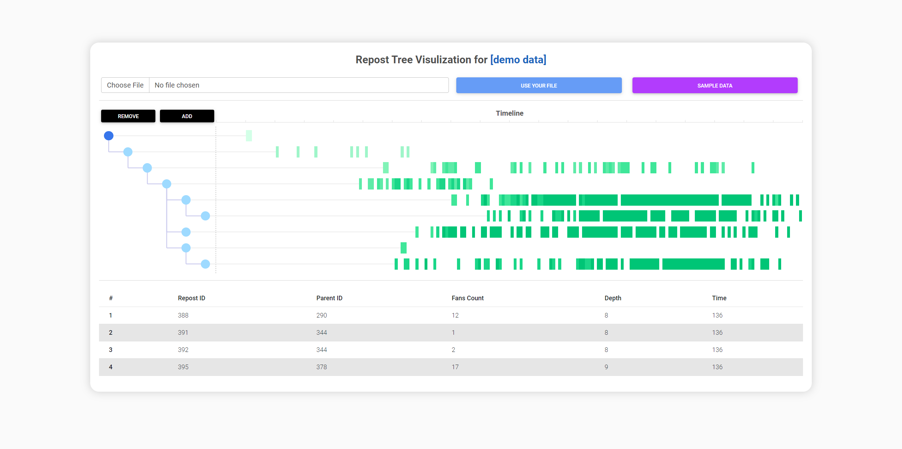

# Visualization of Repost Trees

A simple implementation of visualizing twitter / weibo repost tree.

## Idea

This visualization is taken from [this paper](https://ieeexplore.ieee.org/document/8805419):

> S. Chen, S. Li, S. Chen and X. Yuan, "R-Map: A Map Metaphor for Visualizing Information Reposting Process in Social Media," in IEEE Transactions on Visualization and Computer Graphics, vol. 26, no. 1, pp. 1204-1214, Jan. 2020, doi: 10.1109/TVCG.2019.2934263.

## Data

Since I don't have any dataset of this kind on my hands, I use python to simulate repost behavior. You can reference `./data/generate_data.py` to see more details.

You can upload your own data as long as they fit the structure of sample data, which is a list of nodes with `idx, parent, timestamp, fans` attributes.

